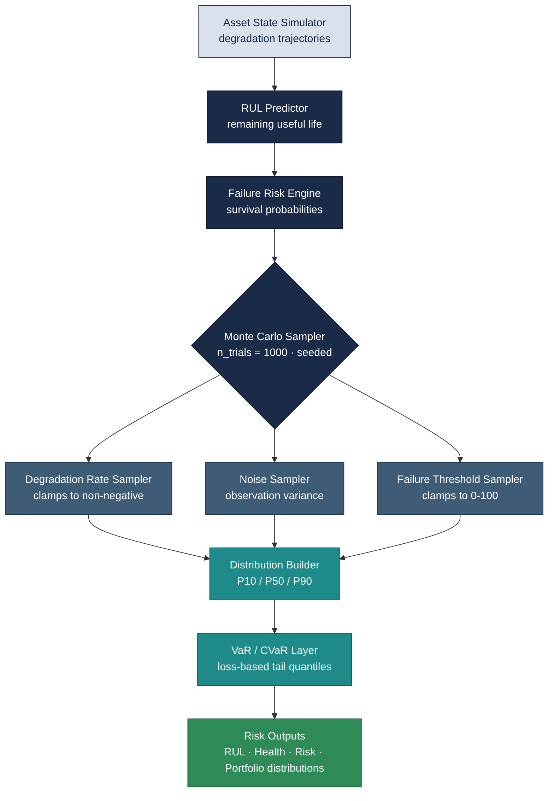
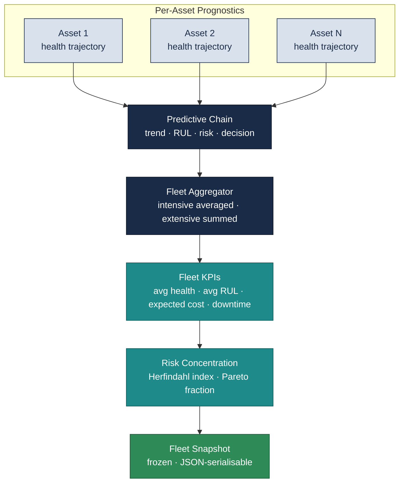
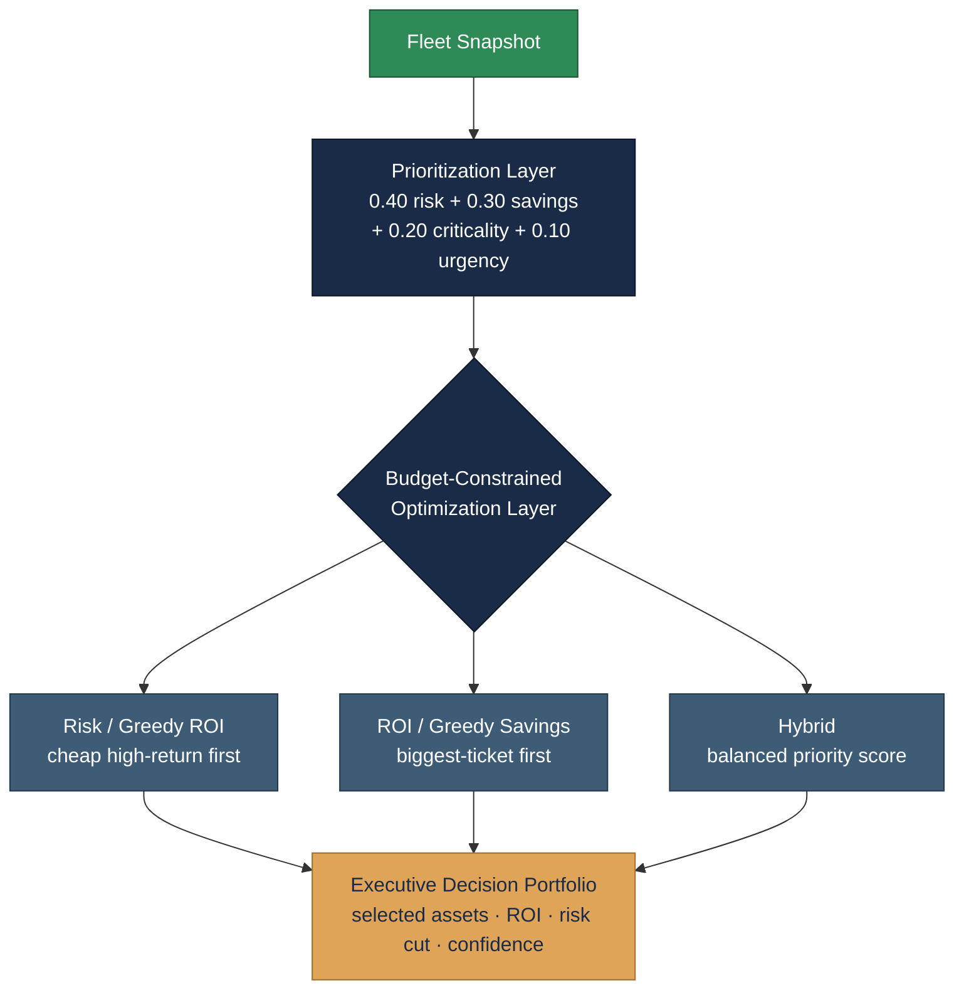
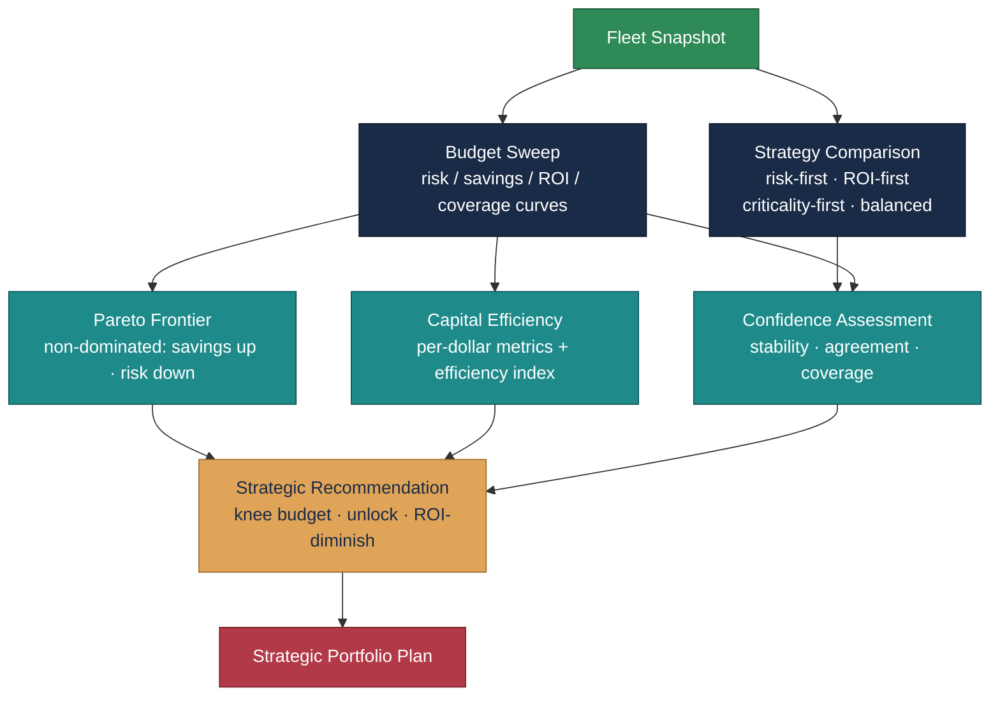
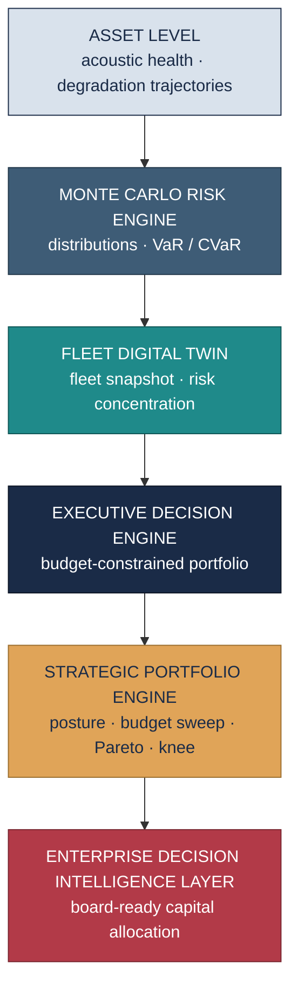
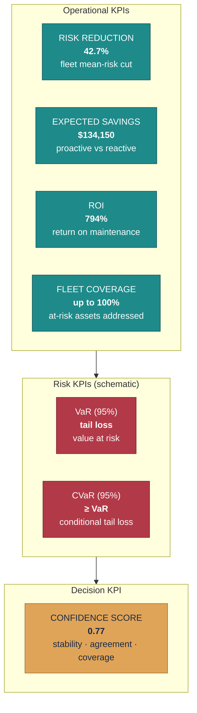
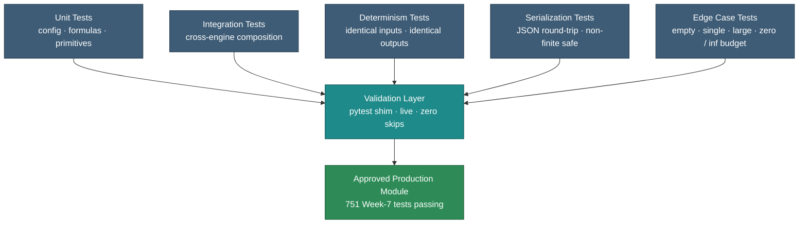

# Week 7 — Enterprise Digital Twin & Decision Intelligence Platform
## Publication-Quality Architecture Diagrams

Eight Mermaid diagrams documenting the Week-7 decision-intelligence stack —
the Monte Carlo Risk Engine, the Fleet Digital Twin, the Executive Decision
Engine, and the Strategic Portfolio Optimization Engine — together with the
complete architecture, a KPI dashboard mockup, the platform data flow, and the
testing architecture. Every diagram is paired with an explanation, an enterprise
interpretation, and a statement of business value.

Figures are grounded in the validated build: 751 Week-7 tests pass (Monte Carlo
202, Fleet 157, Executive 182, Strategic 210), all pure-NumPy, all deterministic.
Representative KPI values are drawn from the live demo runs; the VaR/CVaR figures
in the dashboard mockup are schematic placeholders (flagged inline).

---

## Figure 1 — Monte Carlo Risk Engine Architecture

**Explanation.** The Monte Carlo Risk Engine turns single point estimates into
full probability distributions. A deterministic point trajectory from the Asset
State Simulator flows through the RUL Predictor and Failure Risk Engine; the
Monte Carlo Sampler then perturbs the degradation rate, observation noise, and
failure threshold across a seeded ensemble of trials. The Distribution Builder
assembles P10/P50/P90 quantiles, and the VaR/CVaR layer derives loss-based
tail-risk measures (with CVaR always at least VaR by construction).

**Enterprise interpretation.** A maintenance plan built on a single "expected"
RUL hides the question executives actually care about: *how bad is the bad case?*
This engine answers it by quantifying the spread — the P10 outcome is the
pessimistic-but-plausible scenario a reliability committee should plan against.

**Business value.** Replacing point estimates with distributions converts
maintenance from a gamble into a measured bet. It enables explicit risk appetite
(plan to the P10, not the P50), defensible spare-parts provisioning, and a
tail-risk number (VaR/CVaR) that finance and insurance functions already
understand.

---

## Figure 2 — Fleet Digital Twin Architecture

**Explanation.** The Fleet Digital Twin lifts per-asset prognostics to the fleet
level. Every asset's health trajectory passes through the full predictive chain
(trend → RUL → failure risk → maintenance decision); the Fleet Aggregator then
combines results with the correct semantics — *intensive* quantities such as
risk and health are averaged, while *extensive* quantities such as cost and
downtime are summed. Fleet KPIs and a risk-concentration measure (Herfindahl
index) condense into a single frozen Fleet Snapshot.

**Enterprise interpretation.** Risk concentration is the strategic signal: a
fleet whose risk is spread thinly across many assets is managed very differently
from one where a handful of turbines carry most of the exposure. The Herfindahl
index makes that concentration an explicit, trackable number.

**Business value.** The Fleet Snapshot is the single source of truth that every
downstream decision layer consumes. It turns thousands of sensor streams into
one governed, serialisable object that an operations review can act on —
eliminating spreadsheet reconciliation and giving every stakeholder the same
numbers.

---

## Figure 3 — Executive Decision Engine

**Explanation.** The Executive Decision Engine consumes the Fleet Snapshot and
produces a budget-constrained maintenance portfolio. Each asset receives a
composite priority score (40% risk, 30% normalised savings, 20% criticality,
10% urgency); the optimization layer then fills the budget under one of three
strategies — greedy ROI (cheap high-return repairs first), greedy savings
(biggest-ticket repairs first), or hybrid (balanced priority). The output is an
Executive Decision Portfolio with selected assets, ROI, risk reduction, and a
confidence score.

**Enterprise interpretation.** The three strategies encode three legitimate
executive philosophies. Under capital rationing they genuinely diverge: greedy
ROI maximises return per dollar, while greedy savings chases absolute exposure
reduction. Naming the strategy makes the trade-off a conscious decision rather
than a hidden default.

**Business value.** This is the layer that produces a board-ready approval
package: *here is what to fix this month, what it costs, what it returns, and how
confident we are.* In the validated demo a $15k portfolio delivered roughly 43%
fleet risk reduction at ~795% ROI — the kind of one-line justification a capital
committee can sign off on.

---

## Figure 4 — Strategic Portfolio Optimization Engine

**Explanation.** The Strategic Portfolio Engine sits above the Executive Decision
Engine, running it across four strategic postures and a sweep of budget levels.
The budget sweep produces four response curves; the Pareto frontier isolates
non-dominated portfolios (higher savings AND lower residual risk); capital
efficiency derives per-dollar productivity and an efficiency index; the
confidence assessment blends selection stability, strategy agreement, and
coverage; and the recommendation engine emits rule-based guidance (knee budget,
unlock opportunity, ROI-diminish point) into a single Strategic Portfolio Plan.

**Enterprise interpretation.** This layer answers the question asked *before* the
budget is fixed: how much should we spend at all? The capital-efficiency knee is
the inflection where additional budget stops buying meaningful risk reduction —
the natural anchor for the annual maintenance budget.

**Business value.** It converts a maintenance budget from a negotiated guess into
an optimised, defensible number. In the demo the engine identified a $120k knee,
flagged that a $60k current budget "lies before the Pareto knee point," and
warned that "ROI diminishes beyond $80,000" — exactly the language a CFO needs to
size next year's spend.

---

## Figure 5 — Complete Week 7 Architecture

**Explanation.** The complete Week-7 stack is a clean vertical escalation of
abstraction. Raw asset-level health feeds the Monte Carlo Risk Engine
(uncertainty), which informs the Fleet Digital Twin (aggregation), which the
Executive Decision Engine turns into a budgeted portfolio (tactics), which the
Strategic Portfolio Engine elevates into capital strategy — culminating in an
enterprise decision-intelligence layer.

**Enterprise interpretation.** Each layer speaks to a different altitude of the
organisation: engineers live at the asset and Monte Carlo layers, operations at
the fleet layer, plant management at the executive layer, and the C-suite at the
strategic layer. The same governed data object flows up the stack, so every level
is reasoning about the same reality.

**Business value.** A single coherent pipeline replaces a patchwork of
disconnected tools and spreadsheets. Decisions at every altitude are traceable
back to the same sensor evidence, which shortens approval cycles, withstands
audit, and removes the translation losses that normally occur between engineering
and finance.

---

## Figure 6 — Week 7 KPI Dashboard Mockup

**Explanation.** A management dashboard mockup grouping the seven headline Week-7
KPIs into operational, risk, and decision tiers. The operational figures (risk
reduction, savings, ROI, coverage) and the confidence score are real values from
the validated executive and strategic demo runs; the VaR/CVaR cells are schematic
placeholders, since their numeric values depend on the specific loss
distribution being modelled.

**Enterprise interpretation.** The three tiers map to three audiences in one
view: operations reads the top row, the risk committee reads the middle, and the
approving executive reads the confidence score. Crucially, the confidence score
tells leadership *how much to trust the other six numbers* — a dashboard without
it invites false precision.

**Business value.** A single screen compresses a multi-engine analysis into the
seven numbers a steering committee needs to approve a maintenance programme. It
shortens the meeting, anchors the discussion in quantified trade-offs, and makes
the basis of every figure auditable.

---

## Figure 7 — Week 7 Data Flow Diagram

```mermaid
flowchart LR
    subgraph SRC["Asset Data"]
        T["Health Trajectories"]
    end
    subgraph PRED["Predictive Stack (Wk 1-5)"]
        TR["Trend"] --> RU["RUL"] --> FR["Failure Risk"] --> MD["Maintenance Decision"]
    end
    subgraph SIM["Simulation (Wk 6)"]
        AS["Asset Simulator"]
    end
    subgraph W7["Week 7 Engines"]
        MC["Monte Carlo Risk Engine"]
        FD["Fleet Digital Twin"]
        EX["Executive Decision Engine"]
        ST["Strategic Portfolio Engine"]
    end

    T --> TR
    T --> AS
    AS --> MC
    MD --> FD
    MC -. "distributions" .-> FD
    FD == "FleetSnapshot" ==> EX
    EX == "ExecutiveDecisionPortfolio" ==> ST
    ST == "StrategicPortfolioPlan" ==> OUT["Enterprise Decision Output"]

    classDef src fill:#D9E2EC,stroke:#1A2B47,color:#1A2B47
    classDef pred fill:#3E5C76,stroke:#22384a,color:#ffffff
    classDef sim fill:#3E5C76,stroke:#22384a,color:#ffffff
    classDef eng fill:#1A2B47,stroke:#0d1626,color:#ffffff
    classDef out fill:#B23A48,stroke:#7a2630,color:#ffffff
    class T src
    class TR,RU,FR,MD pred
    class AS sim
    class MC,FD,EX,ST eng
    class OUT out
```

**Explanation.** The data-flow diagram traces every artifact through the
platform. Health trajectories feed both the predictive stack and the Asset
Simulator. The Monte Carlo engine draws on the simulator and informs the Fleet
Digital Twin, which emits the frozen **FleetSnapshot**. That snapshot flows
(bold edges) into the Executive Decision Engine, producing an
**ExecutiveDecisionPortfolio**, which the Strategic Portfolio Engine consumes to
produce a **StrategicPortfolioPlan** — the enterprise decision output.

**Enterprise interpretation.** The three bold edges are the platform's contract
boundaries: FleetSnapshot, ExecutiveDecisionPortfolio, and StrategicPortfolioPlan
are the frozen, serialisable hand-offs between layers. Because each is immutable
and JSON-serialisable, any layer can be versioned, cached, or replaced without
disturbing its neighbours.

**Business value.** Explicit, frozen data contracts are what make the platform
maintainable and auditable at enterprise scale. They let teams own individual
engines independently, support reproducible decision records, and guarantee that
a recommendation can always be traced back to the exact snapshot that produced
it.

---

## Figure 8 — Week 7 Testing Architecture

**Explanation.** Every Week-7 module passes through five test categories — unit
(config validation, formulas, numerical primitives), integration (cross-engine
composition), determinism (identical inputs yield identical outputs),
serialization (JSON round-trips with non-finite-safe handling), and edge cases
(empty, single, and large fleets; zero and infinite budgets). All converge on a
validation layer that runs live with zero skips before a module is marked
production-approved.

**Enterprise interpretation.** Determinism and serialization are not academic
niceties here: a decision engine that can't reproduce its own recommendation, or
can't persist it as JSON, cannot support audit or governance. Promoting these to
first-class test categories is what makes the output trustworthy for capital
decisions.

**Business value.** 751 passing Week-7 tests across the four engines — all
deterministic, all serialisable — convert "the model said so" into a reproducible,
auditable decision record. That is the difference between an analytics prototype
and a system a regulated enterprise can run its maintenance capital through.

---

## Rendering notes

These diagrams use standard Mermaid flowchart syntax with `classDef` styling and
render directly in any Mermaid-compatible viewer (GitHub, GitLab, VS Code with a
Mermaid extension, Obsidian, Notion, or the Mermaid Live Editor at
mermaid.live). The brand palette — navy `#1A2B47`, teal `#1F8A8A`, steel
`#3E5C76`, amber `#E0A458`, green `#2E8B57`, crimson `#B23A48` — matches the
Week-5 and Week-6 figure sets for a consistent publication look across the
platform documentation.